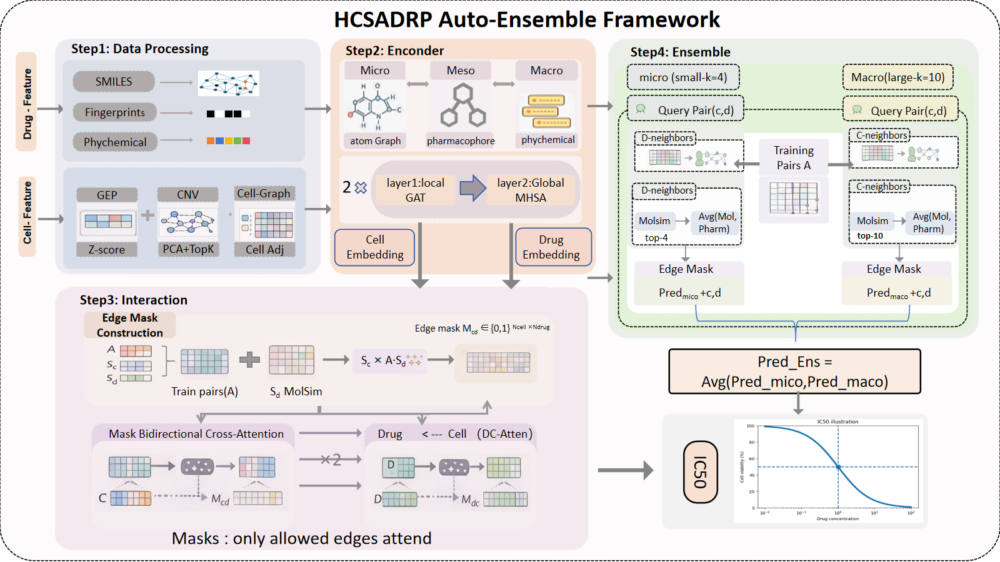

# HSCA-DRP

HSCA-DRP is a deep learning framework for cancer drug response prediction using cell-line molecular features and drug structural features.

## Framework



## Requirements

The project was developed and tested with the following environment:

- Python 3.11.8
- numpy 2.2.6
- torch 2.9.0
- pandas 2.3.2
- scikit-learn 1.7.1
- scipy 1.13.1
- tqdm 4.67.1
- rdkit 2025.09.1

Install dependencies with:

```bash
pip install -r requirements.txt
```

## Project Structure

```text
.
├── run_HSCADRP_five.py     # main script for 5-fold training and evaluation
├── model.py                # HSCA-DRP model definition
├── layers.py               # network layers and structural modules
├── utils.py                # data loading and preprocessing
├── requirements.txt
└── README.md
```

## Data Preparation

All input files should be placed under the following directory:

```text
./data/
```

The current implementation expects these files:

- `GEP.csv` — gene expression data for cancer cell lines
- `CNV.csv` — copy number variation data for cancer cell lines
- `Drug_smiles.csv` — drug identifiers and SMILES strings
- `drug_fingerprints.csv` — drug fingerprint features
- `drug_physchem.csv` — drug physicochemical descriptor features
- `ic50_Filtered.csv` — drug response labels (IC50 values)

## Expected Input Format

### Cell-line data

`GEP.csv` and `CNV.csv` should contain one row per cell line.

- The cell-line identifier column can be named `cell_line`
- If `cell_line` is not present, the first column will be treated as the cell identifier
- Non-feature metadata columns such as `CellName`, `CosmicId`, `Unnamed: 0`, `Sequencing`, and `IsDefault` are ignored during preprocessing

### Drug data

`Drug_smiles.csv` should contain:

- `CID`
- `Canonical_SMILES` or `CanonicalSMILES`

If `DRUG_NAME` is provided, it can also be used to map response labels to PubChem CID.

`drug_fingerprints.csv` and `drug_physchem.csv` should contain:

- a `CID` column, or the first column as CID
- the remaining columns as numeric drug features

### Response data

`ic50_Filtered.csv` should contain:

- a cell-line column named `cell_line` or `cell_name`
- a drug column named `drug` or `cid`
- an `IC50` column

Only samples with matched cell-line features, drug features, and valid IC50 values are kept.

## Data Processing

The current preprocessing pipeline in `utils.py` includes:

- selecting the top 1000 high-variance genes from gene expression data and applying Z-score normalization
- reducing CNV features to 128 dimensions by PCA
- constructing a cell-cell similarity graph from CNV features using cosine similarity with top-k sparsification
- matching drug IDs across SMILES, fingerprint, and physicochemical descriptor tables
- filtering drug outliers in the concatenated fingerprint and descriptor feature space
- generating pharmacophore fingerprints from SMILES using RDKit Gobbi Pharm2D
- reducing drug fingerprint and pharmacophore features to 128 dimensions by PCA
- matching valid cell-drug response pairs and converting them into model input indices

## How to Run

Run the main script with:

```bash
python run_HSCADRP_five.py
```

Example:

```bash
python run_HSCADRP_five.py --epochs 100 --batch 128 --folds 5
```

## Main Arguments

The script currently supports the following arguments:

- `--seed` — random seed, default `0`
- `--epochs` — maximum number of training epochs, default `100`
- `--lr` — learning rate, default `1e-4`
- `--wd` — weight decay, default `1e-5`
- `--batch` — batch size, default `128`
- `--hidden` — hidden dimension, default `128`
- `--nb_heads` — number of attention heads for the main interaction module, default `4`
- `--patience` — early stopping patience, default `15`
- `--drug_nheads` — number of drug-side attention heads, default `4`
- `--n_pharm_tokens` — number of pharmacophore tokens, default `4`
- `--folds` — number of folds for cross-validation, default `5`
- `--k_macro` — candidate expansion size for the macro branch, default `10`
- `--sim_macro` — drug similarity top-k for the macro branch, default `10`
- `--k_micro` — candidate expansion size for the micro branch, default `4`
- `--sim_micro` — drug similarity top-k for the micro branch, default `4`
- `--rank_coef` — ranking loss coefficient, default `0.2`

## Training Procedure

The training script performs 5-fold cross-validation over the matched cell-drug response pairs.

For each fold:

1. the data are split into train, validation, and test sets
2. 10% of the training pairs are further used as a validation set
3. a **Macro** model and a **Micro** model are trained separately
4. the final prediction is computed by averaging the two branches

The current implementation uses:

- MSE loss during warmup epochs
- heteroscedastic regression loss after warmup
- an additional within-drug ranking loss
- early stopping based on validation RMSE
- learning-rate scheduling with `ReduceLROnPlateau`

## Output

Model checkpoints are saved to:

```text
./output/
```

Saved model files follow this naming format:

```text
ensemble_Macro_fold{fold_idx}.pkl
ensemble_Micro_fold{fold_idx}.pkl
```

During training and evaluation, the script reports:

- validation RMSE during training
- per-fold results for Macro, Micro, and Ensemble
- final 5-fold summary with mean and standard deviation for:
  - RMSE
  - MAE
  - PCC
  - R2

## Notes

- The data directory is currently hard-coded as `./data_new` in `utils.py`
- If your file names or directory structure are different, please modify the path settings in `utils.py`
- RDKit is strongly recommended because pharmacophore fingerprints are generated from drug SMILES
- If RDKit is unavailable, the code contains a fallback path, but the resulting drug representation may be degraded

## Contact

For questions about the manuscript or implementation, please contact:

- Yuwei Sun：sun1612806862@163.com
- Juan Wang: wangjuan@imu.edu.cn
